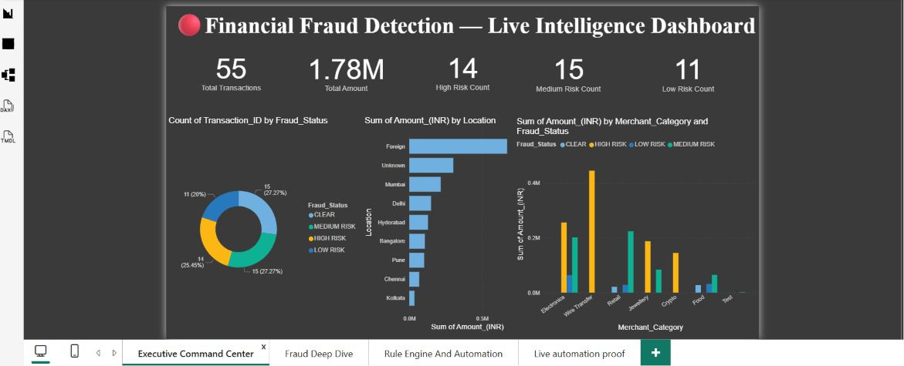
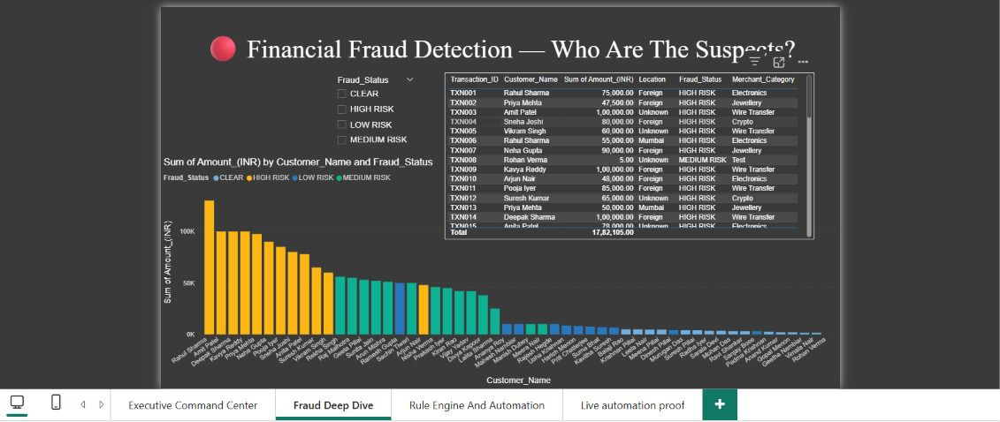
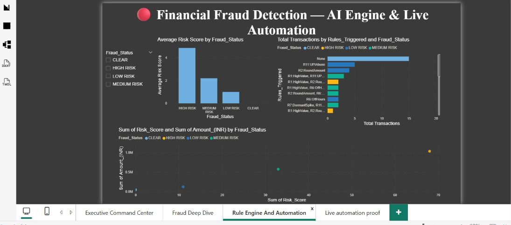
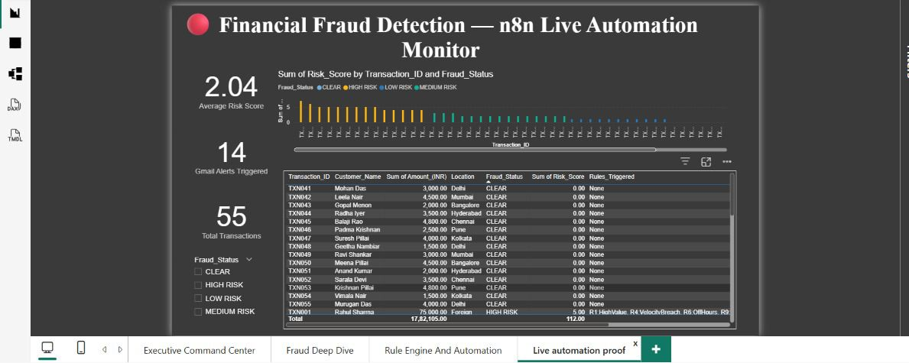

# 📊 AI-Powered Enterprise Financial Risk Monitoring Dashboard

## 📌 Project Overview
The AI-Powered Enterprise Financial Risk Monitoring Dashboard is a Business Intelligence solution designed to monitor financial transactions, detect fraudulent activities, analyze risk patterns, and automate risk alerts.

The project integrates **Power BI**, **Google Sheets**, and **n8n** to provide real-time monitoring, risk scoring, automated notifications, and executive-level financial insights.

This solution helps organizations identify suspicious transactions, improve compliance, and strengthen financial risk management processes.

---

## 🎯 Objectives
- Monitor enterprise financial transactions.
- Detect potentially fraudulent activities.
- Analyze transaction risk scores.
- Automate risk alerts using n8n.
- Create interactive Power BI dashboards.
- Improve financial transparency and decision-making.

---

## 🚀 Key Features

### 🔍 Fraud Detection
- Risk Score Monitoring
- Fraud Status Classification
- Suspicious Transaction Identification

### 📊 Risk Analytics
- Transaction Analysis
- Risk Trend Monitoring
- Location-Based Risk Assessment

### 🤖 Workflow Automation
- Automated Risk Alerts
- Email Notifications
- Real-Time Data Processing using n8n

### 📈 Interactive Dashboards
- KPI Monitoring
- Donut Charts
- Risk Tables
- Location Analysis
- Transaction Type Analysis

---

## 🛠 Technologies Used
- Power BI Desktop
- Google Sheets
- n8n Automation
- Microsoft Excel
- Data Analytics
- Business Intelligence

---

## 📂 Dataset Fields
The dashboard utilizes financial transaction monitoring data including:
- Transaction_ID
- Customer_Name
- Amount_(INR)
- Transaction_Time
- Location
- Account_Age_(Days)
- Prev_Txn_Count
- Outflow_Ratio_%
- Transaction_Type
- Risk_Score
- Fraud_Status

---

## 📊 KPIs Created
- **Total Transactions** — Tracks total number of transactions.
- **Total Transaction Amount** — Displays total value of all monitored transactions.
- **Average Risk Score** — Shows average risk score across transactions.
- **Fraud Transactions** — Identifies high-risk or fraudulent transactions.

---

## 📈 Dashboard Visualizations

### Executive Overview
- Total Transactions KPI
- Total Transaction Amount KPI
- Average Risk Score KPI

### Fraud Analysis
- Fraud Status Donut Chart
- Transaction Type Bar Chart
- Location Analysis Chart

### Risk Monitoring
- Transaction Risk Table
- Customer Risk Assessment
- Fraud Status Monitoring

---

## 📸 Project Screenshots

### Executive Command Center
Real-time overview with total transactions, total amount, risk counts, fraud status donut chart, location-wise transaction amounts, and merchant category risk breakdown.



---

### Fraud Deep Dive — Who Are The Suspects?
Detailed transaction table with customer names, amounts, locations, fraud status, and merchant categories, alongside a customer-wise amount breakdown by fraud status.



---

### Rule Engine & Automation
AI-driven rule engine showing average risk score by fraud status, total transactions by triggered rules (e.g., High Value, Velocity Breach, Off Hours, Round Amount, UPI Abuse), and risk score vs. transaction amount scatter plot.



---

### Live Automation Proof — n8n Integration
Live automation monitor showing average risk score, Gmail alerts triggered, total transactions, and a detailed transaction log with fraud status and triggered rules — powered by n8n workflows.



---

## 🏢 Business Applications

### Banking
- Fraud Detection
- Transaction Monitoring
- Customer Risk Analysis

### FinTech
- Real-Time Risk Intelligence
- Payment Monitoring
- Compliance Support

### Enterprise Finance
- Financial Risk Management
- Internal Control Monitoring
- Executive Risk Reporting

---

## 📚 Learning Outcomes
Through this project, I learned:
- Power BI Dashboard Development
- Business Intelligence Reporting
- Financial Risk Analysis
- Fraud Detection Techniques
- Workflow Automation using n8n
- Data Visualization Best Practices

---

## 🔮 Future Enhancements
- AI-Based Fraud Prediction
- Machine Learning Integration
- Real-Time API Connectivity
- Advanced Risk Scoring Models
- Predictive Analytics Dashboard
- Mobile Dashboard Access

---

## 👨‍💻 Author
**Rohit Pachouri**
IPM Student | Chitkara University
LinkedIn: [www.linkedin.com/in/rohitpachori](https://www.linkedin.com/in/rohitpachori)

---

## 📁 Screenshot Files (root of repo)

```
executive-command-center.jpeg.jpeg
fraud-deep-dive.jpeg.jpeg
rule-engine-automation.jpeg.jpeg
live-automation-proof.jpeg.jpeg
```
